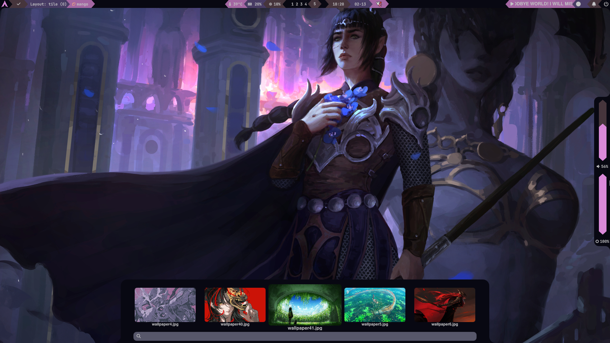

# Quickshell Configuration

A custom Quickshell setup with a modular bar system, popout panels, and MangoWC integration.



## Features

- **Popout Panels** - Bottom and right popout panels for additional controls
- **Dynamic Colors** - Integrates well with color scheme generators
- **Notification Support** - Integrated with SwayNC for system notifications
- **Media Controls** - RMPC integration for music control
- **Theme Selector** - Easily switch between different themes and color schemes
- **brightness and volume controls** - Integrated with ddcutil and system volume control
- **color picker** - Hyprpicker integration for quick color selection
- **Update Checker** - Checks for updates to the system
- **MangoWC integration** - For window management and tag control

## Prerequisites

- **Arch Linux** (or Arch-based distribution)
- **Git** (for installation)
- **Base-devel** (for building AUR packages)

## Dependencies

The installer will automatically install:

| Package | Purpose | Source |
|---------|---------|--------|
| **quickshell** | Main desktop shell | AUR |
| **rmpc** | Music player client | AUR |
| **swaync** | Notification center | Official |
| **hyprpicker** | Color picker tool | Official |
| **python** | Scripting language | Official |
| **python-watchdog** | File system monitoring for hot reload of config | Official |
| **ddcutil** | Brightness control for desktop | Official |
| **wlogout** | Logout/session menu | Official |
| **ttf-fira-code-nerd** | Nerd Font with icons | AUR |

## Installation

### Quick Install

```bash
git clone <your-repo-url> ~/quickshell-config
cd ~/quickshell-config

Make the installer executable and run it:
bash
chmod +x install.sh
./install.sh
```

### Manual Installation

1. Install dependencies using your package manager (e.g., `pacman` and `yay`).
2. Move the configuration files to `~/.config/quickshell/`.
